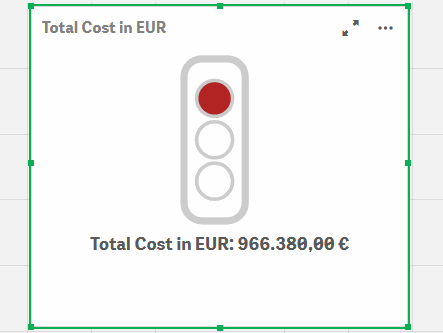
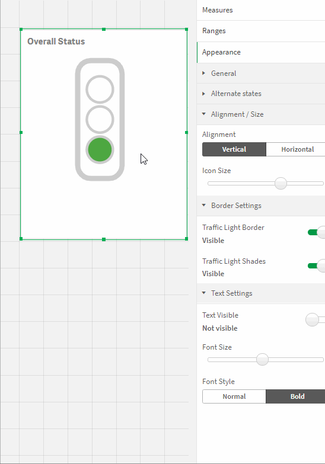
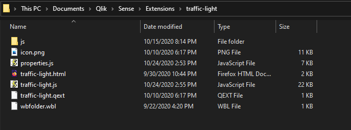
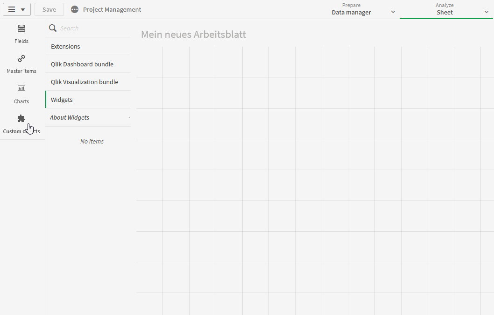
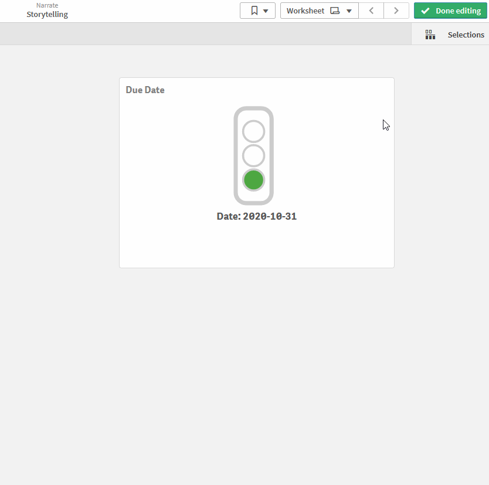
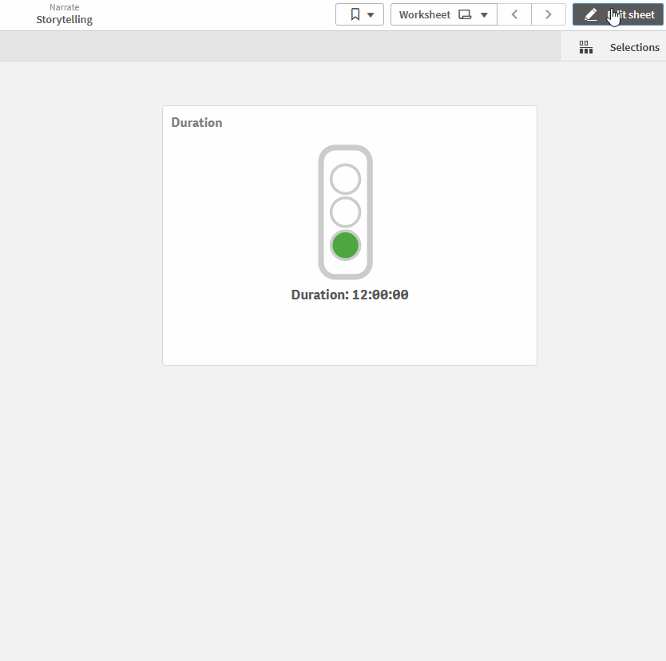
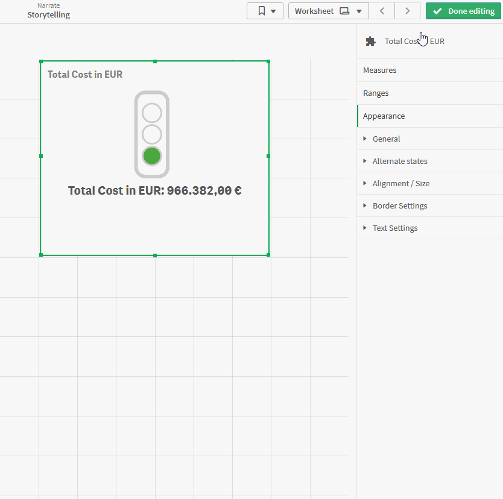

# Traffic Light – Extension for Qlik Sense

Visualization            |  Example Settings
:-------------------------:|:-------------------------:
  |  

## Introduction

Keeping track of your project status and milestones with this visual
traffic light solution! This is the major objective of this traffic
light extension. "Traffic Light" is a highly customizable Qlik Sense
Extension for monitoring your KPIs. Multiple settings like horizontal
and vertical alignment or a two/three light system adapts this extension
to your reporting needs.

This extension can also be used for monitoring and indicating thresholds
for all types of physical measures, quality indicators and divergences
in general. With this, it can be applied to a broad number of uses
cases, that occur different businesses. The following listing shows a
selection of possible uses cases, that had been already implemented:

**Project Management**: Show Project Status in a Project Management
Dashboard

**IT**: Indicate exceeding of system performance threshold in an
IT-Performance-Monitoring Tool

**Infrastructure:** Show buildings, where a threshold for incidents and
repairs is exceeded, which leads to a general evaluation of heavy
maintenance

## Installation

1.  Download the [“Traffic Light
    Master”](https://github.com/leaplytics/traffic-light-qlik-sense/tree/master)
    repository from GitHub

2.  Unzip the downloaded file

3.  Place the folder in your Qlik Sense Extensions directory on your
    computer
    (*C:\\Users\\YourUserName\\Documents\\Qlik\\Sense\\Extensions*) or
    import it with Qlik Management Console (QMC)

There is also a general [installation guide available for Qlik
Sense](https://help.qlik.com/en-US/sense-developer/September2020/Subsystems/Extensions/Content/Sense_Extensions/Howtos/deploy-extensions.htm).

## Getting Started

Open Qlik Sense and the relevant app, where you want to use the “Traffic Light”
extension. Open your worksheet in edit mode and you will find the
extension within the “Custom Objects” section. Drag and Drop the
extension to any area on your dashboard (*You can change the appearance
of the extension later in the advanced settings*).

In the following chapters, you will learn how to use LeapLytics “Traffic
Light” extension and how to customize it to your needs by using the
properties correctly.

### Measures

The measure defines the value, that is processed together with the
ranges to create the colors of the traffic light. The measure can have
all possible QlikSense-Formats. You can add a measure like this:

1.  Click the “Add measure” button in the properties panel under the
    section “Measure” or by clicking the “Add measure” button inside the
    extension window on your dashboard

2.  Choose a measure from the dropdown list and click on it

3.  (Optional): Choose the right aggregation for your needs (Sum, Avg,
    Min, Max, etc.)

**When using time formats, it must be ensured, that the format is set
according to the format of the processed measure.**

### Ranges

When “Ranges” is clicked, you can select between “Three Lights” or “Two
Lights” in order to adjust the look of your traffic light.

Afterwards, define the individual ranges with “Min” and “Max” values in
order to set the intervals of each colour. ***Please use the
format-formulars according to the measure-formular.***

*Keep in mind, that the yellow interval is not applied, if you
select „Two Lights“ in the “Light System” properties (all described use
cases can be applied)*

## Advanced Settings

### Alignment / Size

You can use the alignment switcher to bring your traffic light in a
vertical or horizontal position.

### Border Settings

With the border setting, you can adjust the appearance of the traffic
light to your needs.

“Traffic Light Border” enables or disables the outer borders of your
system.

“Traffic Light Shades” enables or disables the inner borders of the
lights.

### Text Settings

You can apply changes to your text within the “Text Settings”
properties.

Show or hide text with the “Text Visible” switch.

Change the size of the text with the “Font Size” slider.

You can change between bold text and normal text with the “Font Style”
switcher.

## About

This Qlik Sense extension is developed by
[LeapLytics](https://www.leaplytics.de/).

### Compatibility 

This extension has been tested with:

[Qlik Sense
2020/09](https://help.qlik.com/en-US/sense-developer/September2020/Content/Sense_Helpsites/WhatsNew/What-is-new-developer-Sept2020.htm)

[Qlik Sense
2019/09](https://help.qlik.com/en-US/sense-developer/September2019/Content/Sense_Helpsites/WhatsNew/What-is-new-developer-Sept2019.htm)

### Version History

Version 1.0 - Initial Version

### Contact

For further information, training material or use cases contact us via
our [contact form](https://www.leaplytics.de/kontakt/).

For bugs and troubleshooting, you can [file an
issue](https://github.com/leaplytics/traffic-light-qlik-sense/issues).

### Copyright 

Copyright (c) 2020 [LeapLytics](https://www.leaplytics.de/)